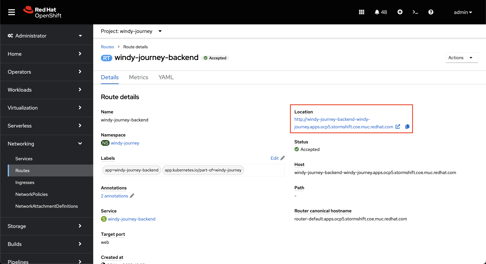

# Automating Visual Inspections with AI - Runtime workshop

Automating Visual Inspections with AI on [Red Hat OpenShift Data Science](https://www.redhat.com/en/technologies/cloud-computing/openshift/openshift-data-science)

## Demo Execution

During the demo we are going to finalize the installation and explain each component of the serverless architecture.

### Deploy the ImageProcessor

The images-processor is implemented as a knative service. It processes the submitted images and detects anomalies.

First, edit `manifests/image-processor/overlays/workshop/kustomization.yaml` and update the inference endpoint:

```
...
path: /data/INFER_URL
value: PASTE_URL_HERE
...
```

(You have set up this URL by creating the Data Connector in [03-workshop-openshift-data-science.md](./03-workshop-openshift-data-science.md), so you can check this in the OpenShift Data Science console)

Now deploy the necessary manifests by applying the `kustomization.yaml` which will use all manifests defined in the [base](../manifests/apps/image-processor/base) folder and patches the INFER_URL value you just changed:

```
oc apply -k manifests/apps/image-processor/overlays/workshop
```

Since we are making use of Knative, the most interesting part is the [Knative Service](../manifests/apps/image-processor/base/knative-service.yaml). Take a look at the `YAML` and see how how it works. You can also check the Serverless section in OpenShift and take a look at Services and Revisions in the OpenShift Admin Web Console:


After the initial startup, the service is scaled back to zero because the service does not receive any images yet. See the Developer Console:


<!--
The images-processor python snippet shows that it is agnostic to Kafka or any other event source:

```python
@app.route('/', methods=['POST'])
def process_image():
    # app.logger.debug(request.headers)

    # create a CloudEvent
    event = from_http(request.headers, request.get_data())

    # you can access cloudevent fields as seen below
    app.logger.info(
        f"Found {event['dashboardid']} from {event['source']} with type "
        f"{event['type']} and specversion {event['specversion']}"
    )
...
``` -->

We are also making use of a default [Broker](../manifests/apps/image-processor/base/knative-broker.yaml) and a [KafkaSource](../manifests/apps/image-processor/base/knative-kafka-source.yaml) where the `KafkaSource` reads messages stored in existing Kafka topics, and sends those messages as [CloudEvents](https://cloudevents.io/) through HTTP to its configured sink (in this case the default `Broker`).

Check the topology in the Developer Console:


Last part of this setup is the [Trigger](../manifests/apps/image-processor/base/knative-trigger.yaml) which is responsible for listening for CloudEvents from the default `Broker` and sends those to a subscriber, in this case our Knative `Service`.


Therefore the ImageProcessor does not need to deal with any Kafka details. It just receives CloudEvents via a [Broker and Trigger](https://knative.dev/docs/eventing/#event-brokers-and-triggers) as explained before.


### Deploy the Dashboard

The Dashboard has 2 parts, a frontend component built with the [Flutter](https://flutter.dev) framework and a backend built with the [NestJS](https://nestjs.com) framework. The backend also listens to `CloudEvents` (check the [knative-trigger.yaml](../manifests/apps/ui/backend/base/knative-trigger.yaml) resource) but in this case the one which are being send by the ImageProcessor after they have been processed and potentially annotated. The backend also acts as a WebSocket server where all images from the `CloudEvent` are being send so clients can receive those directly. The frontend is acting as a WebSocket client which will then ultimately receive those images and display them for the users.

Both applications are classic Kubernetes / OpenShift deployments where we need the combination of `Deployment`, `Service` and `Route` manifests and we are ready. For the sake of customisability, we also make use of `ConfigMap` to adjust specific configuration on the fly (as well as dedicatd `ServiceAccount` which is good practice but not necessary).

There is nothing to adjust for the backend, so we can directly apply the `kustomization.yaml` from the base folder:

```
oc apply -k manifests/apps/ui/backend/base
```

Once deployed, you should see something like this in our OpenShift Web Developer Console:


Once the backend is deployed and running, we have to check the `Route` resource and copy the assign URL. Check the Network -> Routes section in the OpenShift Admin Web Console where you should see "windy-journey-backend". In the detail page of this `Route` you can see the assigned URL in the Location section:



Now click of the copy button at the end of the URL so we can update the patch value in the [kustomization.yaml](../manifests/apps/ui/frontend/overlays/workshop/kustomization.yml):

```
path: /data/config
value: API_URL=PASTE_URL_HERE
```

This enables us to deploy the frontend now accordingly:

```
oc apply -k manifests/apps/ui/frontend/overlays/workshop
```

This deployment will look very similar in the OpenShift Web Developer Console:


You could open up the UI now in your browser (either by clicking the upper right icon of your frontend deployment as seen in the last screenshot or by accessing the `Route` resource via the OpenShift Web Admin Console and copy&paste the URL in the Locatoin section into a new tab).

Altough the UI should be accessible now, no images will be displayed - which is correct at this point! We are missing our last bit: the CamSim.

### Deploy the CamSim:

RAW images of wind turbines could come from different sources. In a real case scenario we could have a drone flying around which takes images in real time. To emulate that we have a python application in place which sends RAW images to a Kafka topic.

Since the CamSim is a lightweight application running in the background only sending out images to a Kafka topic, we only need a `Deployment` and `ConfigMap` resource which we apply with [kustomization.yaml](../manifests/apps/cam-sim/base/kustomization.yaml) again:

```
oc apply -k manifests/apps/cam-sim/base
```

Now you should see the ImageProcessor scaling up since it's receiving CloudEvents through Kafka.
Note, be patient. It takes some time to start the image-processor pod because it needs to initialize TensorFlow and load the model.

### Check the Dashboard (again)

TODO


_ATTRIBUTION: Paul Bergmann, Michael Fauser, David Sattlegger, Carsten Steger. [MVTec AD](https://www.mvtec.com/company/research/datasets/mvtec-ad) - A Comprehensive Real-World Dataset for Unsupervised Anomaly Detection; in: IEEE Conference on Computer Vision and Pattern Recognition (CVPR), June 2019_

## Visual Inspection ML inferencing demo

It is not a lot to demo for the ML inferencing beside showing the dashboard and the logs. The image-processor knative service receives images from kafka, does the tensorflow based inferencing and emits a cloud event for the dashboard and action processor.

Beside viewing the dashboard with the bounding boxes for the anomalies, you can view the log of the images-processor:

```
oc logs -l serving.knative.dev/service=image-processor -c image-processor -f
...
[2021-03-06 20:08:55,959] INFO in image-processor: 2021-03-06 20:08:55.877409 (350, 350, 3)
[2021-03-06 20:08:56,298] INFO in image-processor: Predict: Total object detection took 0.33952 seconds
[2021-03-06 20:08:56,298] INFO in image-processor: ['scratch']
...
```

The `image-processor` receives cloud event that includes a images, calls the TensorFlow ML model, and predicts an anomaly (scratch or bent).

## Demo Clean-up

```
oc delete -f cam/manifests/cam-sim-depl.yaml
oc delete -k dashboard/manifests/
oc delete -k image-processor/manifests/
```

# Troubleshooting hints

## Kafka

Find Kafka Bootstrap server:

```
oc describe Kafka manu-vi -n manuela-visual-inspection
```

Expected example output:

```
...
    Bootstrap Servers:  wvi-kafka-bootstrap.windy-journey.svc:9092
    Name:               plain
    Type:               plain
...
```

Double check that the bootstrap server is defined in the kafka-source:

```
oc describe KafkaSource image-processor-kafka-source
```

Expected example output:

```
...
Spec:
  Bootstrap Servers:
    wvi-kafka-bootstrap.manuela-visual-inspection.svc:9092
 ...
```

Check Topic:

```
oc exec wvi-kafka-0 -c kafka -n windy-journey -- bin/kafka-topics.sh --list --bootstrap-server wvi-kafka-bootstrap.windy-journey.svc:9092
```

Expected example output:

```
__consumer_offsets
__strimzi-topic-operator-kstreams-topic-store-changelog
__strimzi_store_topic
visual-inspection-images
```

Check that messages are arriving:

```
oc exec manu-vi-kafka-0 -c kafka -n manuela-visual-inspection -- bin/kafka-console-consumer.sh --topic visual-inspection-images --bootstrap-server manu-vi-kafka-bootstrap.manuela-visual-inspection.svc:9092


oc exec wvi-kafka-0 -c kafka -n windy-journey -- bin/kafka-console-consumer.sh --topic visual-inspection-images --bootstrap-server wvi-kafka-bootstrap.windy-journey.svc:9092

```

Expected example output:

```
{"image": "data:image/jpeg;base64,/9j/4AAQSkZJRgABAQAAA ... pQhH/9k=", "id": 0, "type": "image", "time": "2023-04-30 10:49:15.506975", "text": "2023-04-30 10:49:15.506975", "label": "good"}
```

Verify that the Kafka event source was created by entering the following command:

```
oc get pods -n knative-eventing | grep -i kafka-source
```

Expected example output:

```
kafka-source-dispatcher-0                             2/2     Running     0          3m55s
```

Check kafka-source logs for errors:

```
oc logs kafka-source-dispatcher-0 -c kafka-source-dispatcher -n knative-eventing
```
